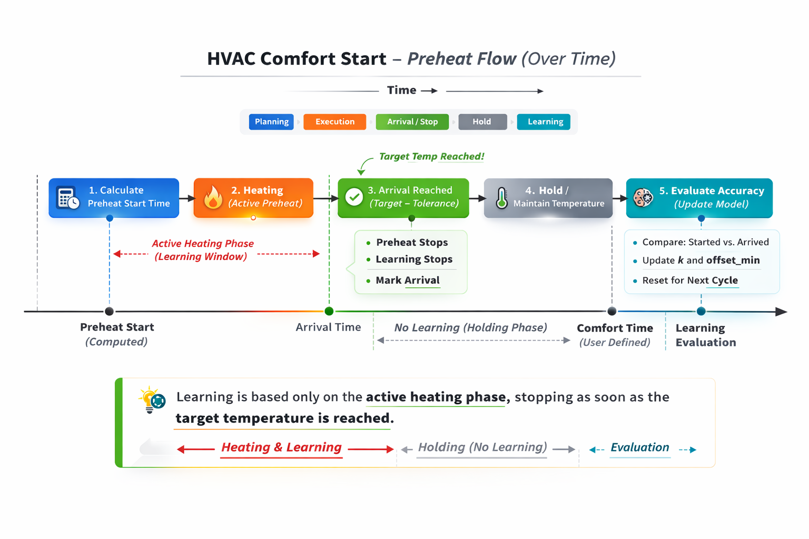

# HVAC Comfort Start — Architecture

**Version:** Release Candidate 1 (RC1-004)  
**Status:** Feature complete; maintenance mode  
**Platform:** Home Assistant + Pyscript  
**Compatibility:** Thermostat-agnostic (`climate` entity based)

---

## Design Goals

HVAC Comfort Start was designed to solve a specific and common problem:

> Reach the desired comfort temperature **at** the configured comfort time — not early, not late — across varying outdoor conditions and HVAC behavior.

Key goals:

- Eliminate fixed offsets and guesswork  
- Learn from real heating cycles  
- Remain stable across days (no oscillation)  
- Survive restarts and configuration changes  
- Prefer slight earliness over lateness  
- Remain thermostat-agnostic at the Home Assistant layer  

---

## High-Level Architecture

Each layer has a single responsibility and minimal coupling to the others.

```
+-------------------+
| Planning          |
| (Recompute)       |
+-------------------+
          |
          v
+-------------------+
| Execution         |
| (Automations)     |
+-------------------+
          |
          v
+-------------------+
| Learning          |
| (Arrival Eval)    |
+-------------------+
```

This represents the conceptual control flow, which is expanded in the full system timeline below.

---

## System Flow Overview

<p align="center">
  
</p>

<p align="center">
  This flow illustrates the RC1-004 arrival-bounded learning model, where learning is strictly limited to the active heating phase.
</p>

---

## 1. Planning Layer — Recompute

**Purpose:**  
Determine *when* preheating must start in order to reach comfort temperature at comfort time.

**Key Inputs:**

- Current indoor temperature  
- Target temperature (from helper)  
- Learned heating rate (`k`)  
- Learned systematic bias (`offset_min`)  
- Optional forecast-based bias  
- Occupancy state  
- Min/max lead constraints  

**Output:**

- Writes `input_datetime.preheat_start`

---

## 2. Execution Layer — Automation

**Purpose:**  
Start and stop preheating at the correct times using Home Assistant automations.

**Responsibilities:**

- Start heating when current time ≥ `preheat_start`  
- Set `input_boolean.preheat_active`  
- Detect arrival (threshold crossing)  
- Clear preheat state at arrival  
- Trigger evaluation at comfort time  

**RC1-004 Behavior:**

Execution includes an **arrival-stop mechanism**:

- Detects first crossing of (target − tolerance)  
- Marks arrival (latched, idempotent)  
- Clears `preheat_active`  

This defines a hard boundary between heating and post-arrival behavior.

---

## 3. Learning Layer — Arrival-Bounded Evaluation

### Primary Trigger

Learning is strictly bounded to:

**preheat start → first arrival (target − tolerance)**

Arrival is:

- Latched once per cycle  
- Idempotent  
- Treated as the end of the heating phase  

This prevents post-arrival modulation or holding behavior from contaminating the model.

---

### Fallback Trigger

If arrival is not detected:

- Learning is finalized at comfort time  

---

## What It Measures

- Indoor temperature vs target  
- Elapsed time since preheat start  
- Effective full-cycle heating performance  

---

## What It Updates

- `k` — minutes per degree (heating rate)  
- `offset_min` — systematic timing bias  

---

## Why This Matters

Modulating HVAC systems reduce output after reaching target temperature.

If learning continues past this point, it introduces bias.

RC1-004 eliminates that by learning only from the true heating phase.

---

## RC1 Status

RC1-004 introduces arrival-bounded learning, completing the control model.

System is:

- Deterministic  
- Stable  
- Fully bounded  

Future work (if any) focuses on usability and packaging, not algorithmic changes.

---

## Summary

HVAC Comfort Start is a small adaptive control system built on real feedback and stable learning boundaries.